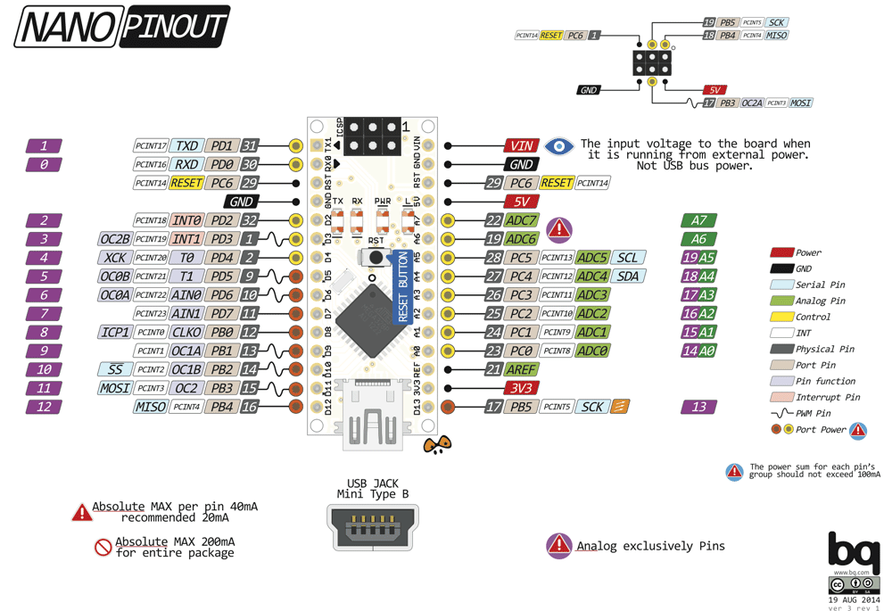

# Evaluación

El examen deberá realizarse en los plazos estipulados en la plataforma.
Se realizara en grupos de 2 personas, no mas.

## Consignas

Se desea realizar un control de tiempo de cocción para un horno panadero, que permita
el encendido del quemador, ventilador de recirculacion y la inyeccion de vapor al horno.
Para esto se dispone de:

* 1 display que indicaran el tiempo de cocción en minutos ( 0 a F, hexadecimal)
* 4 leds indicando la salida activa (quemador, ventilador, válvula de vapor y un buzzer)
* 2 pulsadores que permiten ajustar el tiempo deseado
* 1 pulsador que comienza el tiempo, y permite pausar.
* 1 pulsador que permite cancelar el tiempo.

### El funcionamiento debe ser el siguiente:

1. Debe poder ajustarse el tiempo solo cuando este no esta corriendo o en pausa, es decir
cuando el horno esta en espera.
2. Un pulsador permitirá comenzar la cuenta regresiva o bien pausara/reanudara si ya hab ́ıa
comenzado.
3. Un pulsador permite cancelar en cualquier momento la cuenta regresiva y regresar a el
estado de espera.
4. Mientras el horno esta en espera, las salidas deben estar apagadas. Al comenzar la cuenta
regresiva se enciende el quemador y el ventilador.
5. Cuando se alcanzan las 3/4 partes del tiempo (puede ser aproximado), se debe activar la
válvula de vapor.
6. Mientras el tiempo este pausado, se debe apagar el ventilador.
7. Al finalizar el tiempo deben apagarse el quemador, ventilador y valvula(si estuviese en-
cendida) y sonar el buzzer 10 segundos para luego regresar al estado de espera.

Las funcionalidades propuestas son el máximo, deberán implementarse un mínimo de
4 de estos puntos, y debe poder probarse su funcionalidad.

## Entrega

La entrega en la plataforma consiste en un documento .pdf que contenga:
- [ ] Circuito propuesto para la resolución del problema.
- [ ] Diagrama de flujo, tabla de verdad, diagrama temporal o el recurso utilizado representando
el algoritmo a implementar.
- [ ] Implementación en lenguaje C de acuerdo al circuito propuesto.

## Defensa

La defensa del trabajo se realizara de manera presencial, se debera presentar armado
y funcionando el circuito planteado en el protoboard y con el programa cargado.
La certificacion del trabajo realizado depende de la defensa, es decir que no certificara
aquel que no defienda su trabajo, o bien se evidencie que no es de su produccion personal.

- - - -

## Pinout

## Display


> Nota: Se busca minimizar las lineas que van del micro controlador al panel de display, para
ello utilice un registro de desplazamiento para el manejo de las salidas o las entradas, a
elecci ́on suya.

```C
PC0 -> BOTON 1 
PC1 -> BOTON 2 
PC2 -> BOTON 3 
PC3 -> BOTON 4

PD2 -> SEGMENTO A   
PD3 -> SEGMENTO B 
PD4 -> SEGMENTO C
PD5 -> SEGMENTO D 
PD6 -> SEGMENTO E 
PD7 -> SEGMENTO F
PB0 -> SEGMENTO G
PB1 -> SEGMENTO DP

PB2 -> Quemador
PB3 -> Ventilador
PB4 -> Buzzer
PB5 -> Vapor
``` 

- - - -
